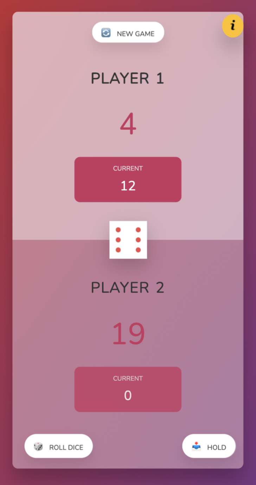

# Welcome to Pig Game - 

This project is created by me [Vatsal Singh](https://www.github.com/vatsalsinghkv). 

## Table of contents

- [Overview](#overview)
  - [The Project](#the-project)
  - [How to play](#how-to-play)
  - [Screenshot](#screenshot)
  - [Links](#links)
- [Unresolved bug](#unresolved-bug)
  - [Bug screenshot](#bug-screenshot)
  - [Methods I tried](#methods-i-tried)
- [My process](#my-process)
  - [Built with](#built-with)
  - [What I learned](#what-i-learned)
  - [Continued development](#continued-development)
  - [Useful resources](#useful-resources)
- [Author](#author)
- [Acknowledgments](#acknowledgments)


## Overview

### The project

Users should be able to:

- View the optimal layout for the app depending on their device's screen size
- See hover states for all interactive elements on the page
- Change the names at the starting of each game
- Name can't be more than 12 characters
- See the rules at any time

### How to play

- If the player rolls a 1, they score nothing and it becomes the next player's turn.
- If the player rolls any other number, it is added to their recent score and the player's turn continues.
- If a player chooses to "hold", their recent score is added to their main score, and it becomes the next player's turn.
- The first player to score 50 or more points wins.

### Screenshot




### Links

- Live Site URL: [https://vatsalsinghkv.github.io/pig-game/](https://vatsalsinghkv.github.io/pig-game)


## Unresolved bug

### Bug screenshot


So the issue I am facing is this, I've made `.overlay` like this:
```
.overlay {
  position: absolute;
  top: 0; left: 0;
  width: 100%; height: 100%;
}
```
But when I open this in Mobile browser (like chrome), It's overlay covers whole screen but when I scroll down and brower's nav goes up, I get empty space at the bottom of the hight of browser's nav

### Methods I tried

- `height: 100vh`
```css
.overlay {
  position: absolute;
  height: 100vh;
}
```

- `bottom: 0`
```css
.overlay {
  position: absolute;
  top: 0;
  left: 0;
  right: 0;
  bottom: 0;
}
```

- Height is equal to `window.innerHeight`
```js
const overlay = document.querySelector('.overlay');
overlay.style.height = `${window.innerHeight}px`;
```


## My process

### Built with

- CSS custom properties
- Flexbox
- Vanilla JavaScript


### What I learned

I've learned lot of stuff in this challenge: 


- How to make a Modal.

```html
<div class="modal hidden">
    <button class="close-modal">&times;</button>
    <!-- Content goes here -->
</div>

<div class="overlay hidden"></div>
```

```css
.modal {
  position: absolute;
  top: 50%;
  left: 50%;
  transform: translate(-50%, -50%);

  width: 60%;

  background-color: white;
  padding: 5rem;
  z-index: 10;
}

.overlay {
  position: absolute;
  top: 0;
  left: 0;
  width: 100%;
  height: 100vh;

  background-color: rgba(0, 0, 0, 0.6);
  backdrop-filter: blur(3px);
  z-index: 5;
}

.close-modal {
  position: absolute;
  top: 1.2rem;
  right: 2rem;
  
  font-size: 5rem;
  color: #333;

  cursor: pointer;
  border: none;
  background: none;
}

.hidden {
  display: none;
}
```

```js
const modal = document.querySelector('.modal');
const overlay = document.querySelector('.overlay');

const showModal = () => {  
  overlay.classList.remove('hidden');
  modal.classList.remove('hidden');
  closeBtn.classList.remove('hidden');
};

const closeModal = () => {
  overlay.classList.add('hidden');
  modal.classList.add('hidden');
  closeBtn.classList.add('hidden');
};

const btnInfo = document.querySelector('.btn--info');
const closeBtn = document.querySelector('.close-modal');

btnInfo.addEventListener('click', showModal);
closeBtn.addEventListener('click', closeBtn);
```


- About forms.

```html
<form autocomplete="off">
  <div class="input-container">
  <label for="name-0">Enter Player-1 name:</label> <br />
  <input type="text" class="form-input" name="name-0" id="name-0" />
  </div>

  <div class="input-container">
  <label for="name-1">Enter Player-2 name:</label> <br />
  <input type="text" class="form-input" name="name-1" id="name-1" />
  </div>

  <div class="btn-container">
  <div class="submit-btn">Submit</div>
  </div>
</form>
```

```css
.input-container {
  margin-top: 2.25rem;
}

.form-input {
  margin-top: 1rem;
  width: 100%;
  padding: 1.25rem 1.75rem;
  border: #cfcfcf 1px solid;
  border-radius: .35rem;
}

.form-input:focus {
  outline: auto;
  outline-color: rgba(191, 46, 52, 0.8);
}

.btn-container {
  text-align: end;
}

.btn-submit {
  display: inline-block;
  margin: 2.5rem 0 0 0;
  padding: 1.25rem 3.5rem;

  color: #fff;
  background-color: #c7365f;

  border: none;
  border-radius: .35rem;
  cursor: pointer;
}
```

```js
const formValidation = () => {
  name = [];
  name.push(document.getElementById('name-0').value);
  name.push(document.getElementById('name-1').value);

  if (name[0]) {
    name[0] = name[0].length > 12 ? name[0].slice(0, 12) : name[0];
    document.getElementById('name--0').textContent = name[0];
  }
  if (name[1]) {
    name[1] = name[1].length > 12 ? name[1].slice(0, 12) : name[1];
    document.getElementById('name--1').textContent = name[1];
  }
};
```


- How to animate pressed buttons.

```css
.pressed {
  opacity: 0.5;
  /* Effects you want */
}
```

```js
const animateKey = (key) => {
  key.classList.add('pressed');
  setTimeout(() => key.classList.remove('pressed'), 100);
};

const btnInfo = document.querySelector('.btn--info');

btnInfo.addEventListener('click', (e) => {
  animateKey(e.target);
});
```


- How to make a info (modal calling) button.

```html
<button class="btn--info">
    <picture>
      <source media="(max-width: 825px)" srcset="images/info.png">
      
    </picture>
  </button>
```

```css
.btn--info {
  background-color: #FFC107;
  padding: 10px;
  border: none;
  border-radius: 50%;

  position: fixed;
  right: 10%;
  bottom: 10%;

  cursor: pointer;
  transition: all .2s;
}

.btn--info:hover {
  transform: scale(1.125);
}
```

```js
btnInfo.addEventListener('click', showModal);
```


- How to disable `input` at runtime.

```js
if(condition) {
  input.forEach(item => item.setAttribute('disabled', true));
} else {
  input.forEach(item => item.removeAttribute('disabled'));
}
```


- I have improved my logical and debugging skills.

- Learned how to make web responsive.

### Continued development

### Stuff I find usefull and want to learn:

- Bootstrap
- Node.js
- Express
- React
- CSS Svg
- CSS Canvas
- JS Regular Expressipns
- Flutter & Dart


### Useful resources

- [TheNetNinja Youtube](https://www.youtube.com/c/TheNetNinja) - This helped me learn jQuery, GitHub, CSS Grid. This guy is legend there's lot of stuff to learn, which I will be learning in future.
- [GeeksForGeeks](https://www.geeksforgeeks.org/) - This is amazing website for articles, snippets, projects, algorithms etc.
- [MDN Docs](https://developer.mozilla.org/en-US/) - This is an amazing reference which helped me finally understand detailed concepts like data- attr, aria attr, input range etc.

## Author

- Github - [@vatsalsinghkv](https://github.com/vatsalsinghkv)
- Twitter - [@vatsalsinghkv](https://www.twitter.com/vatsalsinghkv)
- Instagram - [@vatsal.sing.hkv](https://www.instagram.com/vatsal.singh.kv)
- Facebook - [@vatsalsinghkv](https://www.facebook.com/vatsal.singh.kv)
- Frontend Mentor - [@vatsalsinghkv](https://www.frontendmentor.io/profile/vatsalsinghkv)

## Acknowledgments

- [Jonas Schmedtmann](https://www.udemy.com/user/jonasschmedtmann/) - For teaching and giving me this project.